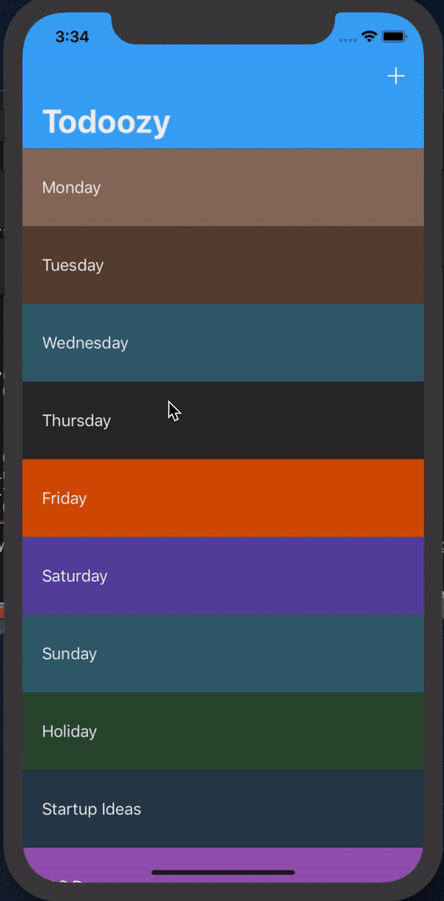

# Todo application
Application completed to learn core data and realm 

## Description
Using Swift, Xcode and Firebase to build a chat application where users can sign up, login and chat.

## Sample User Flow

## Features

* Sign Up/Login (Username and Password stored and retrieved using firebase)
* Chat functionality between limited users

## Future Functionality
- Allow for users to view own photos as well as others
- Allow for geolocation functionality

